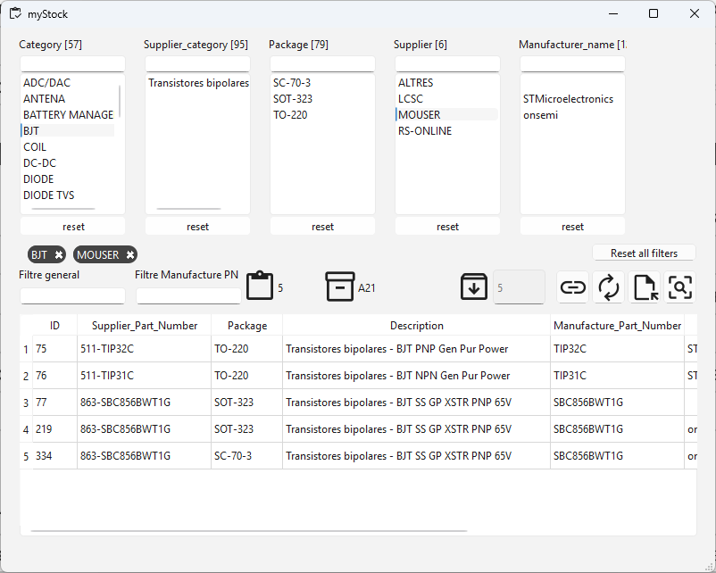
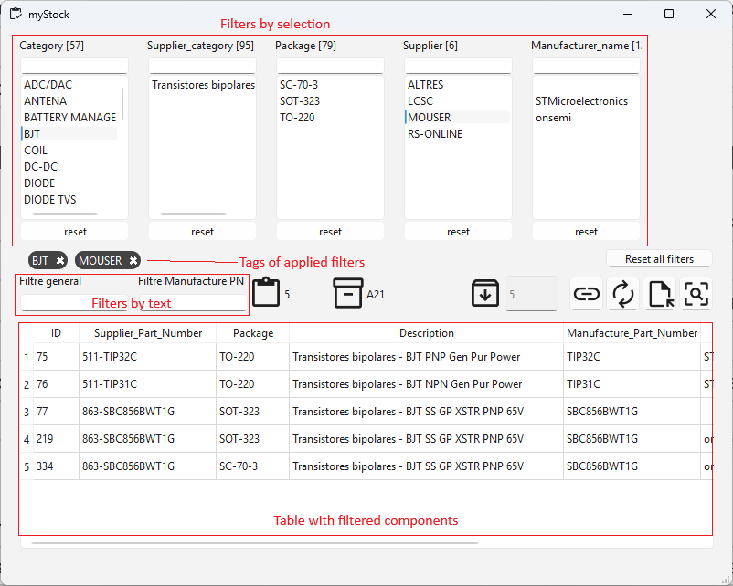
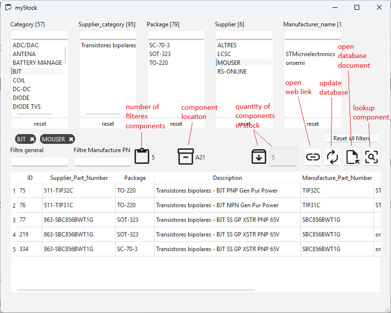
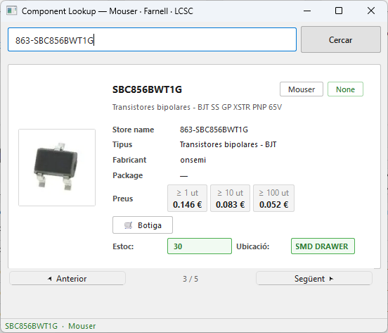

# 📦 MyStock

A flexible desktop app to visualize and filter your personal inventory.

**MyStock** is a simple tool designed by a maker, for makers.  
It helps you quickly find what components you already have at home, using a more convenient interface than browsing a spreadsheet.

The app reads your inventory from **Google Sheets** and lets you filter, search and explore your stock instantly.

Although it was originally designed for **electronic components**, it can be adapted to **any type of inventory**.


---
[](https://github.com/CasamaMaker/myStock/stargazers)
[](https://github.com/CasamaMaker/myStock/network)
[](https://github.com/CasamaMaker/myStock)
[](LICENSE.txt)

[Features](#-features) •
[Screenshots](#-screenshots) •
[Example Use Case](#-example-use-case) •
[Requirements](#-requirements) •
[Built With](#-built-with) •
[Installation](#-installation) •
[Configuration](#️-configuration) •
[Contributing](#-contributing) •
[License](#-license)
---

# ✨ Features

### 🔍 Powerful filtering
- Multiple dynamic filters
- Free text search across the database
- Visual filter tags that can be removed with one click
- Filters automatically disable when no results are available

### 📊 Clean stock visualization
- See **stock quantity**
- See **storage location**
- View **component description**
- Open **datasheets or product pages** directly
- You can easily **search the component on Mouser / Farnell / LCSC** and retrieve supplier information such as image, description, prices, datasheet, etc.

### ☁️ Google Sheets integration
- Uses a Google Sheet as the database
- Real-time updates
- Easy multi-device editing
- No local database needed

### 🧩 Highly configurable
MyStock was designed to be **easy to adapt**.

You can configure:

- Which columns are used from google sheets
- Which colums use as filters
- Which columns show to present the components filtered
- How many filters use

This allows you to reuse the app for:
- electronic components
- workshop parts
- tools
- mechanical parts
- any personal inventory

---

# 📷 Screenshots

### Main interface



### Components lookup from supplier


<!-- ### Component detail
 -->

---

# 🎯 Example Use Case

Imagine you are building a project and need a **3.3V regulator in SOT-23 package**.

With MyStock you can:

1. Filter **Type → Voltage Regulator**
2. Filter **Package → SOT-23**
3. Search **3.3V**
4. Instantly see all matching components
5. Check **how many you have**
6. See **where they are stored**
7. Open the **datasheet** with one click
8. More over, once component from the table is selected, you can press the button "component lookup" and it will find this component to Mouser/Farnell/LCSC and show more info, include a picture

No more scrolling through spreadsheets.

---

# ⚙️ Requirements

Before installing MyStock, make sure you have:

- **Python 3.8 or newer**
- A **Google Cloud account** and **api key**
- A **Google Sheet** containing your inventory
- A **Mouse, Farnell** api key

---

# 🚀 Installation

```bash
# 1. Clone the repository
git clone https://github.com/your-username/mystock.git
cd mystock

# 2. Install dependencies
pip install -r requirements.txt
```

**`requirements.txt`**
```
PySide6
gspread
google-auth
requests
```

---

# ⚙️ Configuration

All configuration lives in the `Config` class at the top of `mystock.py`. You only need to touch this one place.

### 1. Set up Google Sheets API

#### Create a Google Cloud project

1. Go to [Google Cloud Console](https://console.cloud.google.com/)
2. Create a new project
3. Go to **APIs & Services → Library** and enable:
   - **Google Sheets API**
   - **Google Drive API**

#### Create a Service Account

1. Go to **APIs & Services → Credentials → Create Credentials → Service Account**
2. Fill in a name (e.g. `mystock-service`) and click **Done**
3. Open the service account, go to **Keys → Add Key → Create new key → JSON**
4. Save the downloaded `.json` file as:
   ```
   credentials/your-credentials-file.json
   ```

> ⚠️ **Never commit the `credentials/` folder to Git.** It's already in `.gitignore`.

#### Share your Google Sheet

1. Open your Google Sheet
2. Click **Share** and add the `client_email` from your JSON file
3. Grant **Editor** access

### 2. Configure `mystock.py`

```python
class Config:
    # --- Column indices (0-based, matching your Google Sheet) ---
    ID              = 0
    MANUFACTURER_PN = 1
    MANUFACTURER    = 2
    CATEGORY        = 3
    SUPPLIER        = 4
    SUPPLIER_PN     = 5
    PACKAGE         = 7
    DESCRIPTION     = 8
    STOCK           = 9
    STORAGE         = 10
    DATASHEET       = 11

    # --- Behaviour ---
    STOCK     = STOCK           # shown in the info label
    STORAGE   = STORAGE         # shown in the info label
    WEB       = DATASHEET       # opened in the browser
    REFERENCE = SUPPLIER_PN     # unique identifier per row
    TEXT_FILTER = MANUFACTURER_PN  # column used for the PN search box

    # --- Active filters (assign any column index) ---
    FILTRE1 = CATEGORY
    FILTRE2 = SUPPLIER_CATEGORY
    FILTRE3 = PACKAGE
    FILTRE4 = SUPPLIER
    FILTRE5 = MANUFACTURER

    # --- Table display ---
    COLUMNS_TO_SHOW = [ID, REFERENCE, PACKAGE, DESCRIPTION, MANUFACTURER_PN, MANUFACTURER]
    COLUMNS_WIDTH   = [50, 150, 80, 300, 150, 150]

    # --- Google Sheets credentials ---
    GOOGLE_SHEET_ID          = "your_sheet_id_here"
    GOOGLE_CREDENTIALS_JSON  = "credentials/your-credentials-file.json"
```

#### How to find your Sheet ID

```
https://docs.google.com/spreadsheets/d/THIS_IS_THE_ID/edit
```

### 3. Enable or disable filters

Each filter panel can be turned on or off independently:

```python
FilterConfig(
    column_index=PACKAGE,
    ...
    enabled=True    # set to False to hide this filter panel
),
```

When a filter is disabled, its sidebar panel is automatically hidden.

### 4. Run the app

```bash
python mystock.py
```

---

# 🧰 Built With

| Technology | Purpose |
|------------|---------|
| Python 3.8+ | Core language |
| PySide6 (Qt6) | Desktop GUI |
| gspread | Google Sheets API |
| google-auth | Google authentication |
| requests | HTTP requests |
| Qt Designer | UI design |

---

# 📁 Project Structure

```
mystock/
│
├── mystock.py             # main program
├── component_lookup.py    # lookup components windows program
├── request_general.py     # test of request functions
├── request_mouser.py      # mouser api request functions
├── request_lcsc.py        # lcsc web request functions
├── request_farnell.py     # farnell api request functions
├── ui_main.py             # main UI from QTdesigner converted to .py
├── ui_main.ui             # main UI from QTdesigner
├── ui_component_lookup.py # lookup components UI from QTdesigner converted to .py
├── ui_component_lookup.ui # lookup components UI from QTdesigner
├── recursos_grafics_rc.py # Qt resource file compiled to Python (icons, images, etc.)
│
├── credentials/           # Google service account credentials (not in git)
│
├── docs/
│   └── images/            # screenshots
│
├── requirements.txt
├── myStock.spec
├── README.md
└── LICENSE
```

---

## 🔍 Stock filter window


---

## 🔍 Component Lookup window

`component_lookup.py` is a companion window that lets you search any component by part number, or by scanning a barcode from LCSC, Mouser, or Farnell packages.

It shows:
- Component name, manufacturer, package, description
- Live price tiers
- Supplier availability (green / red tag)
- Product image
- Links to the product page and datasheet
- Your personal stock quantity and storage location (read from the same Google Sheet)
- Edit stock and location directly from the lookup window
- Navigate through filtered results with ◀ / ▶ buttons

You can open it from the main window by selecting a component and clicking the lookup button.

---

# ⚙️ Setup

## 1. Enable Google Sheets API

Create a project in **Google Cloud Console** and enable:

- Google Sheets API
- Google Drive API

## 2. Create a Service Account

Generate a **JSON key** and place it inside:

```
credentials/
```

Example:

```
credentials/mystock-service-account.json
```

Make sure this folder is ignored by git.

## 3. Share the Google Sheet

Share your Google Sheet with the service account email.


## 4. Obtain the token for each marketplace

Register on the respective API platforms. Here are the links where you can sign up and get your API tokens (to be provided):
   - **[Market Mouser API Registration Link]** - 
   https://eu.mouser.com/api-search/#signup
   <!-- - **[Market DIGIKEY API Registration Link]** -
   https://www.digikey.es/en/resources/api-solutions -->
   - **[Market ELEMENT 14 API Registration Link]** - 
   https://partner.element14.com/docs 
   <!-- - **[Market TME API Registration Link]** -
   https://developers.tme.eu/signup -->
---

# 🛠 Configuration

The behavior of MyStock can be customized inside:

```
mystock.py
```

You can configure:

- column indexes
- filters
- table columns
- data sources

Example:

```python
STOCK = 0
STORAGE = 1
REFERENCE = 3
TEXT_FILTER = 4
```

This makes the application flexible for different spreadsheet layouts.

---

# 📈 Roadmap

Possible future improvements:

- add/modify component from app
- import BoM file from project and generate a table with component location and be able to rest they from stock.


---

# 🤝 Contributing

Contributions are welcome.

If you'd like to improve MyStock:

1. Fork the repository
2. Create a branch
3. Commit your changes
4. Open a Pull Request

Ideas are also welcome via Issues.

---

# 📄 License

MIT License

---

# 👨‍💻 Author

Created by a maker who was tired of searching components in spreadsheets.

If this project is useful to you, consider giving it a ⭐ on GitHub.

**GitHub**: [@CasamaMaker](https://github.com/el-teu-usuari)
